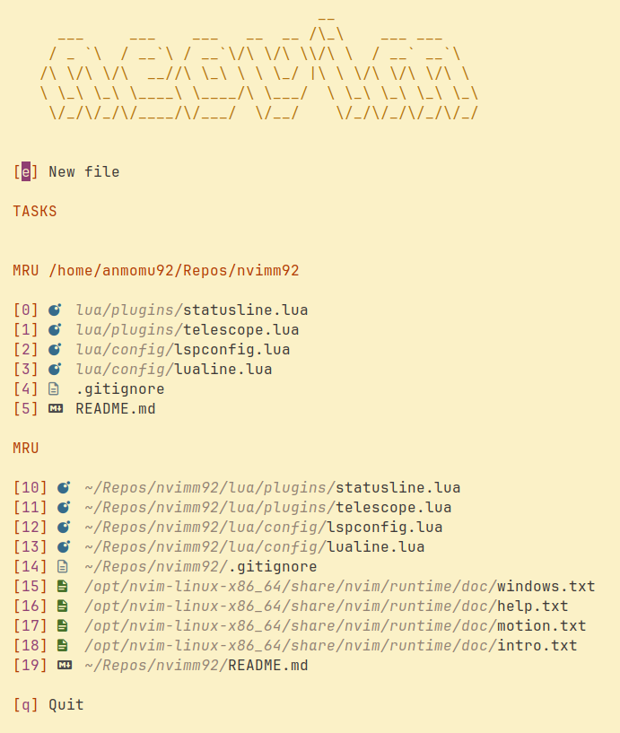

<h1 align="center">Nvimm92</h1>

<div align="center">

[](LICENSE)
[]()

</div>

This is my personal configuration for Neovim. After being a Nvchad user for some time, I decided to set up my own Neovim configuration from scratch. It includes the plugins I find more useful for my personal use, so it may not fit your needs in every way. Also, I am not neither a Neovim nor a Lua expert, so there may be some mistakes that I have not noticed so far. Any help is more than welcome. 

## Dashboard
> [!NOTE]
> [goolord/alpha-nvim](https://github.com/goolord/alpha-nvim)



## Important keybindings
| Basic commands | Keybinding |
| ---------- | :----------: |
| Exit | Esc |
| Save | Ctrl+s |

| Navigation | Keybinding |
| ---------- | :----------: |
| Cycle through tabs | Tab |
| Focus left window | Ctrl+h | 
| Focus right window | Ctrl+l | 
| Focus above window | Ctrl+k | 
| Focus below window | Ctrl+j | 

| Panels | Kybindings |
| ------ | :----------: |
| File explorer | Alt+n |
| Vertical terminal | Alt+l |
| Horizontal terminal | Alt+j |
| Lazygit | Alt+g |


## ⚡ Main features

### Autopairing
> [!NOTE]
> [windwp/nvim-autopairs](https://github.com/windwp/nvim-autopairs)

### Top Bar
> [!NOTE]
> [romgrk/barbar.nvim](https://github.com/romgrk/barbar.nvim)

A bar for showing the current opened buffers.

### Colorizing
> [!NOTE]
> [brenoprata10/nvim-highlight-colors](https://github.com/brenoprata10/nvim-highlight-colors)

### Colorscheme
> [!NOTE]
> [ellisonleao/gruvbox.nvim](https://github.com/ellisonleao/gruvbox.nvim)

My favorite colorscheme is gruvbox. It supports both light and dark themes.

### Completion

Snippets and such is supported in some languages.

## 🛠️ Installation

> NOTE
> Before installing this repo, make a backup of your current config files in case you want it back.

To install this Neovim configuration, just clone this repository to the default Neovim's dotfiles location.

```bash
git clone https://github.com/anmomu92/nvimm92.git ~/.config/nvim && nvim
```

## 🤝 Contributions

Any kind of suggestion or improvement is suggested. Please, open an issue or merge request to discuss changes.

## 📜 License

GPL-3.0 license.
